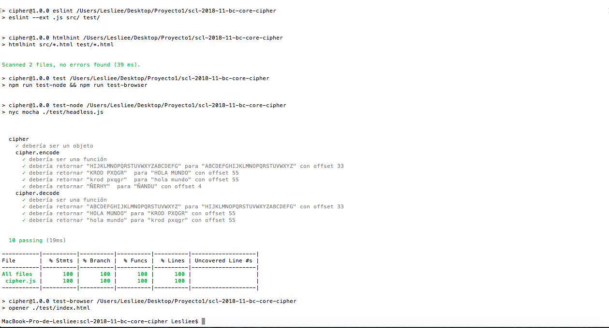

# Introducción

CipherText es una aplicación para mantener una conversación privada/secreta con
tus amigos, familia o quien tu quieras y que solo uds puedan descifrar. CipherText aumenta la seguridad de tus mensajes mediante la codificación del contenido, de manera que solo pueda leerlo la persona que cuente con la clave de cifrado adecuada para descifrarlo.
La idea es que ingreses el mensaje que quieres cifrar y además escojas un desplazamiento que va ser determinante para obtener tu mensaje codificado, el cual podrás enviarselo a tus amigos junto con el offset elegido y así ellos podrán ingresar a CipherText y descifrar tu mensaje.

¿Qué es el cifrado César?
CipherText cifra y descifra mensajes basándose en el Cifrado César.
El cifrado césar es una de las técnicas más simples para cifrar un mensaje. Es un tipo de cifrado por sustitución, es decir que cada letra del texto original es reemplazada por otra que se encuentra un número fijo de posiciones (desplazamiento) más adelante en el mismo alfabeto.

# Instalación
Por el momento esta app no requiere instalación, ya que se accede a ella desde el siguiente link:
(https://LeslieSaVa.github.io/scl-2018-11-bc-core-cipher/index.html)

# Usuario ¿Quién?
Hombres y mujeres entre 17 y 35 años que utilicen redes sociales, especialmente
facebook o whatsapp, para mantenerse en contacto y comunicarse con sus amigos
y familia, que sean dependientes del celular o que pasen mucho tiempo en rrss.

# Necesidad ¿Para qué?
Principalmente para que los usuarios puedan mantener conversaciones realmente privadas y secretas con la o las personas que ellos deseen en el caso de que en su entorno exista alguien que les revisa el celular, también  en caso de pérdida de este sus conversaciones no se filtren o publiquen sin su consentimiento o que simplemente quieren que sus conversaciones no se lean fácilmente a simple vista.

# Historia de usuario

## Javiera y su historia
Javiera, tiene 20 años es estudiante universitaria, usuaria de rrss facebook pero sobre todo de whatsapp, pasa todo el día revisando sus mensajes y su email. Javiera quiere contarle a su mejor amiga  que quiere terminar con su pololo porque hay actitudes de él que le molestan como que no la deja salir con sus amigas y que le revisa el celular periodicamente.
Pepita ingresa a CipherText y utiliza la página para escribir su situacíon, obtener un mensaje cifrado y poder copiarlo para enviarselo con tranquilidad a su amiga por whatsapp o facebook junto al desplazamiento(offset) que ella escogió para que su amiga entre a CipherText, pegue el mensaje, digite el offset y pueda descifrar el mensaje de su amiga y a su vez escribirle una respuesta y cifrarla.

# Planificación
https://trello.com/b/uueobsCT/proyecto-1

## Primer Sketch
Durante la planificación, en el primer boceto del proyecto se esperaba realizar dos pantallas. La primera donde se encontraría una breve explicación de la aplicación, las instrucciones de uso y un botón para comenzar que llevaría a la siguiente pantalla.En la segunda pantalla se encontraría el recuadro de texto donde el usuario debe ingresar su mensaje, a continuación una caja de texto más pequeña donde el usuario debe ingresar un número (offset), luego al apretar uno de los botones de cifrar o descifrar se desplegara la caja de texto donde se le mostrara el mensaje ya cifrado. Finalmente encontrara un botón para volver al inicio,
que corresponde a la primera pantalla.

# ¿Cómo funciona?
- El usuario debe ingresar a la página
- Leer breve introducción acerca del sitio y su utilidad
- Debe leer la breve instroducción acerca del Cifrado César para saber que es
el offset o desplazamiento que será requerido más adelante
- Luego presionar el botón Comenzar para pasar a la siguiente pantalla
- Leer las intrucciones
- Escribir el mensaje que desea cifrar en la caja de texto donde se lee "Escribir mensaje"
- A continuación, debe elegir y escribir un número cualquiera en el recuadro que dice offset
- Luego debe presionar el botón de cifrar o descifrar según sea el caso
- El mensaje cifrado o descifrado será presentado en otra caja de texto que se encontrara debajo del recuadro del offset
- El usuario puede copiar su mensaje cifrado y a través de los links que se encuentran al final de la página
acceder más rápido a la red social de su preferencia para enviar ese mensaje codificado a quien desee.
- Por último el usuario tendrá la opción de volver a la página principal presionando el botón Volver que se encuentra al final de la página
***

# Test Aplicados
Para ejecutar los test se debe correr la instrucción "npm test". El resultado en la consola es el siguiente:

# Consideraciones de diseño
- Debido a la simple finalidad de la página se decidió realizar solo dos pantallas. La primera donde se explica brevemente de que trata la aplicación, para que usarla y qué es el offset. La segunda es donde se encuentran las instrucciones,el área de texto donde el usuario debe escribir su mensaje, la caja del offset, los botones de Cifrar y Descifrar, además de un botón Volver y el área de texto donde se mostrara el mensaje cifrado o descifrado.

- El principal cambio con respecto al primer sketch presentado es que finalmente se decidió especificar las instrucciones en la segunda pantalla para no abrumar al usuario con tanto texto en la primera pantalla y así dejarla un poco más clara y precisa.

- El tipo de tipografía elegido se debe a que es una fuente clara, poco cursiva y más redonda para que sea mas legible y fácil de leer para el usuario.

- Los parrafos están dispuestos de esa manera (el primero de centrado y el que le sigue de izq a derecha) ya que existen estudios donde se comprueba que el ojo humano esta acostumbrado para comenzar a leer de izquierda a derecha.

- La gama de colores elegida fue con la finalidad de darle confianza al usuario, que su imagen fuera de una página confiable y a la vez neutra (para Hombres y mujeres) que se vea clara, luminosa, simple.
Esta paleta la obtuve de la página https://materializecss.com/color.html y la que utilice fue la siguiente:

- Una de las imágenes de la página escogida fue con la finalidad de contagiar al usuario las ganas de usar la app en su celular y a la vez mostrar la conectividad al ver muchas manos y celulares, idealmente enviandose mensajes. Son imagénes que reprensentan a los amigos junto con la tecnología y la conectividad de hoy en día.

- También se puede observar una imagen  del cifrado césar para ayudar a comprender al usuario (con un ejemplo) como funciona el cifrado césar y que es el offset.

- Las instrucciones son cortas y precisas para que el usuario no se abrume con
tantas consideraciones de uso.
- Se incluye un alert para avisarle al usuario que en caso de que su mensaje
contenga la letra Ñ, esta no sera cifrada y se mostrara tal cual en el mensaje cifrado
- Al final de la página se encuentran enlazadas las principales rrss con el finalidad de facilitarle al usuario el envío de su mensaje a amigos o a quién el estime conveniente.
- El resultado final de la página se muestra en la siguiente imagen:

